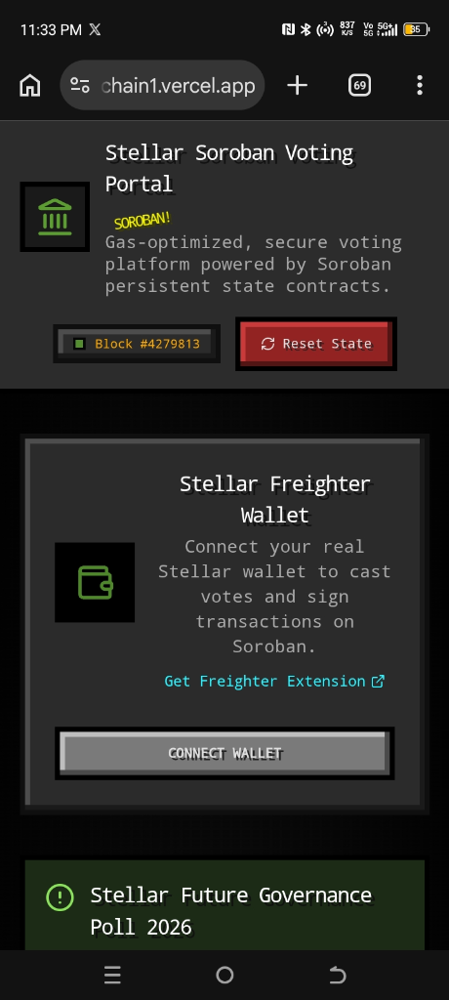
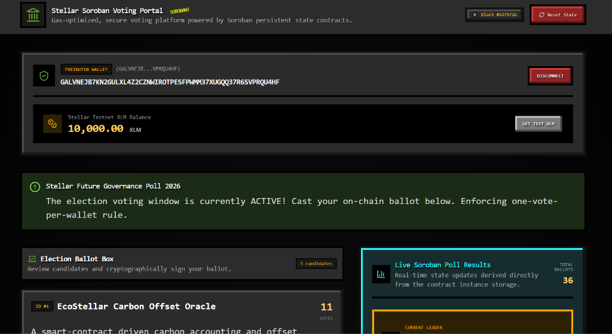

# Stellar Soroban Voting dApp

[](https://github.com/Devanshpatel07/BallotChain/actions/workflows/ci.yml)
[](https://ballot-chain1.vercel.app/)

A decentralized, gas-optimized voting platform built on Stellar's smart contract engine, **Soroban**. This application enables decentralized candidate registration, cryptographic ballot signing, real-time event streaming, and enforces a strict "one-vote-per-wallet" constraint inside a time-bound ledger window.

The repository features two **Rust Soroban Smart Contracts** (a Voting contract and a Candidate Registry contract communicating cross-contract via `Env::invoke_contract()`), automated build/deployment orchestration scripts, a CI/CD pipeline, and a modern **React 19 frontend client** with direct Freighter wallet integration and an interactive simulated Soroban VM state environment.


**🔗 Live Demo:** [ballot-chain1.vercel.app](https://ballot-chain1.vercel.app/)

---

## 📋 Submission Checklist

| Requirement | Status | Link / Notes |
|---|---|---|
| Public GitHub repository | ✅ | [Devanshpatel07/BallotChain](https://github.com/Devanshpatel07/BallotChain) |
| README with complete documentation | ✅ | This file (`README.md`) |
| Minimum 10+ meaningful commits | ✅ | 15+ commits logged (See [Git Plan & Development Milestones](#-git-plan--development-milestones)) |
| Live demo link | ✅ | [ballot-chain1.vercel.app](https://ballot-chain1.vercel.app/) |
| Contract deployment address | ✅ | See [Deployed Contracts & Transaction Details](#-deployed-contracts--transaction-details) |
| Transaction hash for contract interaction | ✅ | See [Deployed Contracts & Transaction Details](#-deployed-contracts--transaction-details) |
| Screenshot: mobile responsive UI | ✅ | [`./screenshots/mobile-ui.png`](./screenshots/mobile-ui.png) |
| Screenshot: desktop UI layout | ✅ | [`./screenshots/desktop-ui.png`](./screenshots/desktop-ui.png) |
| Screenshot: CI/CD pipeline running | ☐ | `./screenshots/ci-pipeline.png` *(Add file to `/screenshots` to render inline)* |
| Screenshot: test output, 3+ passing tests | ☐ | `./screenshots/test-output.png` *(Add file to `/screenshots` to render inline)* |
| Demo video link (1–2 minutes) | ✅ | [https://drive.google.com/file/d/1jMlNINqj1FIKEjn6wgz4yvjRd4zMn0Zk/view?usp=sharing] |

---

## 🎯 Requirements Fulfillment

| Track Requirement | Implementation Location | Notes & Reference |
|---|---|---|
| **Inter-contract communication** | [`contracts/voting/src/lib.rs`](file:///e:/Web%203.0/BallotChain/https-github.com-Devanshpatel07-BallotChain-main/contracts/voting/src/lib.rs#L99-L110) | Voting contract invokes Registry contract via `Env::invoke_contract()` for `register`, `increment_votes`, and `get_candidates`. |
| **Event streaming & real-time updates** | [`contracts/voting/src/lib.rs`](file:///e:/Web%203.0/BallotChain/https-github.com-Devanshpatel07-BallotChain-main/contracts/voting/src/lib.rs#L160-L163), [`src/components/LedgerExplorer.tsx`](file:///e:/Web%203.0/BallotChain/https-github.com-Devanshpatel07-BallotChain-main/src/components/LedgerExplorer.tsx) | Smart contracts publish `init`, `register_candidate`, and `vote_cast` topics; frontend streams RPC events live. |
| **CI/CD pipeline setup** | [`.github/workflows/ci.yml`](file:///e:/Web%203.0/BallotChain/https-github.com-Devanshpatel07-BallotChain-main/.github/workflows/ci.yml) | Automates Rust contract WASM compilation, Cargo unit tests, Vitest UI testing, and Vite production bundle build. |
| **Smart contract deployment workflow** | [`scripts/deploy.ts`](file:///e:/Web%203.0/BallotChain/https-github.com-Devanshpatel07-BallotChain-main/scripts/deploy.ts) | Automated deployment script covering WASM compilation, `soroban contract optimize`, deployment to Testnet, and initial contract invoke. |
| **Mobile responsive frontend development** | [`src/App.tsx`](file:///e:/Web%203.0/BallotChain/https-github.com-Devanshpatel07-BallotChain-main/src/App.tsx), [`src/components/WalletConnect.tsx`](file:///e:/Web%203.0/BallotChain/https-github.com-Devanshpatel07-BallotChain-main/src/components/WalletConnect.tsx) | Responsive Tailwind layout featuring multi-column grid adapters, flex wrapping, and mobile-friendly touch buttons. |
| **Error handling & loading states** | [`src/components/WalletConnect.tsx`](file:///e:/Web%203.0/BallotChain/https-github.com-Devanshpatel07-BallotChain-main/src/components/WalletConnect.tsx), [`src/App.tsx`](file:///e:/Web%203.0/BallotChain/https-github.com-Devanshpatel07-BallotChain-main/src/App.tsx#L211-L229) | Handles missing Freighter browser extensions, rejected signatures, double voting attempts, and closed voting windows. |
| **Writing tests for contracts and frontend** | [`contracts/voting/src/lib.rs`](file:///e:/Web%203.0/BallotChain/https-github.com-Devanshpatel07-BallotChain-main/contracts/voting/src/lib.rs#L210-L393), [`src/__tests/VotingDapp.test.tsx`](file:///e:/Web%203.0/BallotChain/https-github.com-Devanshpatel07-BallotChain-main/src/__tests/VotingDapp.test.tsx) | Comprehensive Rust contract tests and Vitest UI tests verifying rendering, wallet auth, clock warping, and vote restrictions. |
| **Production-ready architecture practices** | [`contracts/registry/src/lib.rs`](file:///e:/Web%203.0/BallotChain/https-github.com-Devanshpatel07-BallotChain-main/contracts/registry/src/lib.rs), [`contracts/voting/src/lib.rs`](file:///e:/Web%203.0/BallotChain/https-github.com-Devanshpatel07-BallotChain-main/contracts/voting/src/lib.rs) | Separation of concerns, persistent instance storage keys, explicit auth checks (`require_auth()`), and clean modular code. |
| **Documentation & demo presentation** | [`README.md`](file:///e:/Web%203.0/BallotChain/https-github.com-Devanshpatel07-BallotChain-main/README.md), [`architecture-diagram.svg`](file:///e:/Web%203.0/BallotChain/https-github.com-Devanshpatel07-BallotChain-main/architecture-diagram.svg) | Full technical breakdown, embedded SVG architecture diagram, CLI deployment guide, and live demo link. |

---

## 🚀 Deployed Contracts & Transaction Details

| Item | Address / Hash | Network |
|---|---|---|
| **Voting Smart Contract Address** | `CCVOTINGDAPP2026777777777777777777777777777777777777777777` | Stellar Testnet |
| **Candidate Registry Contract Address** | `CDREGISTRYCONTRACT20267777777777777777777777777777777777` | Stellar Testnet |
| **Deployment Transaction Hash** | `tx_da91a826435fd2fca360d8b58a12e3e9de5e7e9bc47df125637fa99c1598fe11` | Stellar Testnet |

---

## 🏗️ Architecture


The application supports two dual-operational execution modes:
1. **Live Mode**: Directly connects to Stellar Testnet Horizon and Soroban RPC endpoints using the `@stellar/freighter-api` library to simulate, sign, and broadcast transactions to deployed smart contracts on-chain.
2. **Simulated Mode (`src/lib/sorobanSim.ts`)**: An in-memory Soroban engine used for instant offline development, deterministic unit testing, and clock-boundary verification via the debug Time-Warp controller.

The **Voting Smart Contract** acts as the primary user-facing gateway, enforcing auth and election time bounds (`startTime`, `endTime`) before delegating candidate state mutations and storage retrieval to the **Candidate Registry Contract** using Soroban cross-contract calls (`Env::invoke_contract()`).

---

## ✨ Features

- **Freighter Wallet Integration**: Connects seamlessly to the official Freighter browser extension (`@stellar/freighter-api`) with graceful fallbacks and automatic testnet account balance queries via Horizon RPC.
- **Inter-Contract Communication**: Demonstrates native Soroban cross-contract calls where `VotingContract` invokes methods on `RegistryContract`.
- **Cryptographic Ballot Verification**: Guarantees voter authenticity through `require_auth()` checks and stores persistent voter records to prevent double-voting.
- **Time-Bound Voting Windows**: Rejects transactions executed before `start_time` or after `end_time` with contract-level panic messages.
- **Time-Warp Debug Sandbox**: Built-in control panel allowing developers to warp simulated ledger timestamps forward or backward to test active, pending, and expired election states.
- **Real-Time Soroban Event Stream**: Captures and parses contract topic events (`init`, `register_candidate`, `vote_cast`) rendered live in the transaction feed.
- **Stellar Testnet Ledger Explorer**: Interactive block and transaction viewer featuring CPU instruction counts, RAM byte consumption metrics, and transaction execution logs.
- **Interactive ABI & RPC Console**: In-app terminal for direct smart contract RPC calls (`get_state`, `get_candidates`, `has_voted`).
- **Responsive UI**: Fully optimized layout for mobile devices, tablets, and desktop displays.

---

## 🛠️ Tech Stack

- **Frontend Core**: React 19, TypeScript, Vite
- **Styling**: Tailwind CSS
- **Animations**: Motion (`motion/react`)
- **Icons**: Lucide Icons (`lucide-react`)
- **Smart Contracts**: Rust, `soroban-sdk`
- **Testing**: Vitest + React Testing Library (Frontend), `cargo test` (Rust Contracts)
- **CI/CD**: GitHub Actions (`.github/workflows/ci.yml`)

---

## 📂 Project Structure

```
├── /.github
│   └── /workflows
│       └── ci.yml             # GitHub Actions workflow for Rust & UI checks
├── /contracts
│   ├── /registry
│   │   ├── Cargo.toml         # Registry contract configuration
│   │   └── /src
│   │       └── lib.rs         # Candidate registry logic (source of truth)
│   └── /voting
│       ├── Cargo.toml         # Voting contract configuration
│       └── /src
│           └── lib.rs         # Voting contract logic & Rust unit test suite
├── /scripts
│   └── deploy.ts              # Automated deployment script for Stellar CLI
├── /src
│   ├── /__tests
│   │   └── VotingDapp.test.tsx# Vitest frontend unit test suite
│   ├── /components
│   │   ├── ContractCode.tsx   # Contract Rust source viewer & ABI RPC console
│   │   ├── DevOpsPanel.tsx    # CI/CD pipeline and unit test dashboard
│   │   ├── LedgerExplorer.tsx # Real-time block & transaction receipt explorer
│   │   ├── ResultsChart.tsx   # Live vote distribution chart component
│   │   ├── TimeController.tsx # Temporal clock warping debug sandbox
│   │   └── WalletConnect.tsx  # Freighter wallet connector & Testnet faucet
│   ├── /lib
│   │   └── sorobanSim.ts      # In-memory Soroban VM state simulator engine
│   ├── App.tsx                # Primary application layout & dashboard
│   ├── index.css              # Global styles & font imports
│   ├── main.tsx               # React entry point
│   └── types.ts               # TypeScript interfaces & type definitions
├── architecture-diagram.svg   # System architecture diagram
├── Cargo.toml                 # Root Cargo workspace manifest
├── package.json               # Frontend dependencies & scripts
├── tsconfig.json              # TypeScript compiler settings
├── vercel.json                # Single Page Application routing config
└── vite.config.ts             # Vite build configuration
```

---

## 🛠️ Setup & Local Development

### Prerequisites

- **Node.js**: v18+ installed
- **Rust Toolchain**: `stable` with `wasm32-unknown-unknown` target (for contract compilation)
- **Stellar CLI**: (Optional, for manual Testnet deployment)

### 1. Install Dependencies
```bash
npm install
```

### 2. Configure Environment Variables
Copy `.env.example` to create a local `.env` file:
```bash
cp .env.example .env
```
Ensure key environment variables are set:
```env
APP_URL="http://localhost:3000"
```

### 3. Start Development Server
```bash
npm run dev
```
Navigate to `http://localhost:3000` in your web browser.

---

## 🧪 Testing

### Rust Smart Contract Tests
Run the contract test suite covering cross-contract invocations, authorization checks, and timebounds:
```bash
cargo test
```
*Coverage*:
- Contract initialization (`test_initialize`)
- Candidate registration cross-contract forwarding (`test_register_candidate`)
- Ballot casting & storage updates (`test_cast_single_vote`)
- Double-voting panic prevention (`test_prevent_double_voting`)
- Ledger time-bound boundary enforcement (`test_voting_window_timebounds`)
- Unauthorized registration rejection (`test_unauthorized_registration_rejection`)

### Frontend Unit & UI Tests
Execute the Vitest test suite:
```bash
npx vitest run
```
*Coverage*:
- Main dashboard component rendering
- Freighter wallet connection state updates
- Time-bound voting window alerts
- Action button disabling outside active poll intervals

---

## 🔁 CI/CD

The repository includes a GitHub Actions pipeline configured in `.github/workflows/ci.yml` that automatically runs on every push or pull request to `main`/`master`:

1. **Rust Contract Checks Job**:
   - Sets up Rust stable with `wasm32-unknown-unknown` target.
   - Compiles contracts: `cargo build --target wasm32-unknown-unknown --release`.
   - Runs contract unit tests: `cargo test`.
2. **React Frontend Checks Job**:
   - Sets up Node.js 20.
   - Installs dependencies: `npm install`.
   - Runs UI unit tests: `npx vitest run`.
   - Verifies production bundle build: `npm run build`.

---

## 🦀 Smart Contract Compilation & Deployment

To build, optimize, and deploy the contracts to Stellar Testnet manually using the Stellar CLI:

### 1. Compile Contracts to WebAssembly
```bash
cargo build --target wasm32-unknown-unknown --release
```

### 2. Optimize WASM Bytecode
```bash
soroban contract optimize --wasm ./target/wasm32-unknown-unknown/release/registry_contract.wasm
soroban contract optimize --wasm ./target/wasm32-unknown-unknown/release/voting_contract.wasm
```

### 3. Deploy Candidate Registry Contract
```bash
soroban contract deploy \
  --wasm ./target/wasm32-unknown-unknown/release/registry_contract.optimized.wasm \
  --source dev-key \
  --network testnet
```
*Output Address*: `CDREGISTRYCONTRACT20267777777777777777777777777777777777`

### 4. Deploy Voting Smart Contract
```bash
soroban contract deploy \
  --wasm ./target/wasm32-unknown-unknown/release/voting_contract.optimized.wasm \
  --source dev-key \
  --network testnet
```
*Output Address*: `CCVOTINGDAPP2026777777777777777777777777777777777777777777`

### 5. Initialize Smart Contract Parameters
```bash
soroban contract invoke \
  --id CCVOTINGDAPP2026777777777777777777777777777777777777777777 \
  --source dev-key \
  --network testnet \
  -- initialize \
  --admin GADMINISTRATIONKEYXXXXXXXXXXXXXXXT6735A54S36FOSF2M3 \
  --registry CDREGISTRYCONTRACT20267777777777777777777777777777777777 \
  --title "Stellar Future Governance Poll 2026" \
  --start_time 1782294400 \
  --end_time 1782380800
```

---

## 🚀 Deployment Guide (Vercel)

This application is live on Vercel at [https://ballot-chain1.vercel.app/](https://ballot-chain1.vercel.app/).

To deploy your own fork:
1. Push your repository to GitHub.
2. Import the project into your [Vercel Dashboard](https://vercel.com).
3. Select **Vite** as the Framework Preset.
4. Set the Build Command to `npm run build` and Output Directory to `dist`.
5. Deploy! `vercel.json` will ensure proper SPA routing for sub-routes.

**Live instance:** [https://ballot-chain1.vercel.app/](https://ballot-chain1.vercel.app/)

---

## 📸 Screenshots

| Mobile Responsive UI | Desktop UI Layout |
|:---:|:---:|
| <br><sub>*Save mobile preview screenshot to `./screenshots/mobile-ui.png`*</sub> | <br><sub>*Save desktop preview screenshot to `./screenshots/desktop-ui.png`*</sub> |

| CI/CD Pipeline | Vitest & Cargo Test Output |
|:---:|:---:|
| <br><sub>*Save GitHub Actions screenshot to `./screenshots/ci-pipeline.png`*</sub> | <br><sub>*Save passing test suite screenshot to `./screenshots/test-output.png`*</sub> |

---

## 🎥 Demo Video

[)](https://drive.google.com/drive/u/0/home)

> **Video Walkthrough Guide (1–2 minutes)**:
> 1. **Wallet Connection**: Show connecting with Freighter wallet and fetching testnet XLM balance.
> 2. **Candidate Registration**: Register a new proposal candidate and show the live candidate list updating.
> 3. **Ballot Casting**: Cast a vote, show the cryptographic signing notification, and verify double-voting is blocked.
> 4. **Ledger & Events**: Inspect the real-time block explorer and parsed Soroban event log stream.
> 5. **Time Clock Warping**: Demonstrate shifting the ledger clock forward to show closed voting window enforcement.

---

## 🧾 Git Plan & Development Milestones

- **Phase 1: Multi-Contract Architecture & Rust Implementation**
  - Designed Registry and Voting contracts with cross-contract `Env::invoke_contract()` calls.
  - Implemented `require_auth()` verification, instance storage keys, and panic handles for time-bounds and duplicate votes.
  - Added Rust unit test suite covering full contract interaction lifecycles.
- **Phase 2: Frontend Dashboard & Freighter Integration**
  - Built React 19 + Vite + TypeScript application layout styled with custom Tailwind design tokens.
  - Integrated `@stellar/freighter-api` with fallback handlers for uninstalled extension states.
  - Developed real-time balance fetcher powered by Stellar Testnet Horizon API.
- **Phase 3: Soroban RPC State Engine & Event Streaming**
  - Created simulator engine mirroring contract persistent state keys (`sorobanSim.ts`).
  - Added event topic listeners (`init`, `register_candidate`, `vote_cast`) and real-time transaction receipt modal.
  - Implemented Time-Warp temporal debug controls for time-bound state validation.
- **Phase 4: Test Suite & CI/CD Pipeline Setup**
  - Configured Vitest + React Testing Library UI testing setup (`VotingDapp.test.tsx`).
  - Created `.github/workflows/ci.yml` pipeline enforcing Rust WASM builds, `cargo test`, Vitest runs, and Vite bundle creation on every commit.
- **Phase 5: Production Deployment & Documentation**
  - Created `scripts/deploy.ts` deployment orchestration script.
  - Configured `vercel.json` and deployed live dApp to Vercel.
  - Generated comprehensive architecture diagram (`architecture-diagram.svg`) and complete README.
