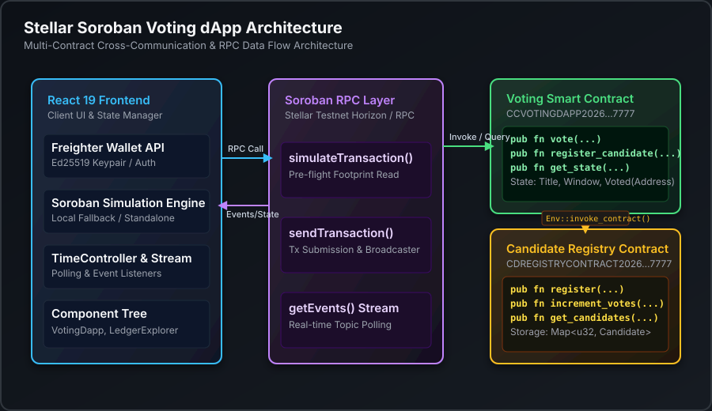

# Stellar Soroban Voting dApp

A decentralized, gas-optimized voting platform on Stellar's smart contract platform, **Soroban**. This application enables candidate registration, live polling, and enforces a strict "one-vote-per-wallet" rule within a time-bound election window.

The repository contains two **Rust Soroban Smart Contracts** (a Voting contract and a Candidate Registry contract communicating cross-contract), deployment orchestration scripts, a CI/CD pipeline, and a rich **React frontend client** that includes a simulated Stellar Testnet blockchain environment — letting you interact with on-chain memory states, simulate Friendbot faucets, track gas fees (CPU/RAM metrics), and inspect ledger transaction receipts in real time.


**🔗 Live Demo:** [ballot-chain1.vercel.app](https://ballot-chain1.vercel.app/)

---

## ✅ Submission Checklist

| Requirement | Status | Link / Notes |
|---|---|---|
| Public GitHub repository | ☐ | `(https://github.com/Devanshpatel07/https-github.com-Devanshpatel07-BallotChain/edit/main/README.md)` |
| README with complete documentation | ✅ | This file |
| Minimum 10+ meaningful commits | ☐ | See [Git Plan](#-git-plan--development-milestones) below |
| Live demo link | ✅ | [ballot-chain1.vercel.app](https://ballot-chain1.vercel.app/) |
| Contract deployment address | ✅ | See [Deployed Contracts](#-deployed-contracts--transaction-details) |
| Transaction hash for contract interaction | ✅ | See [Deployed Contracts](#-deployed-contracts--transaction-details) |
| Demo video link (1–2 minutes) | ☐ | [YOUR_VIDEO_LINK_HERE](#) |

> Replace every `☐` with `✅` and fill in the placeholder links/images before final submission.

---

## 🚀 Deployed Contracts & Transaction Details

| Item | Value |
|---|---|
| Voting Smart Contract Address | `CCVOTINGDAPP2026777777777777777777777777777777777777777777` |
| Candidate Registry Contract Address | `CDREGISTRYCONTRACT20267777777777777777777777777777777777` |
| Deployment Transaction Hash | `tx_da91a826435fd2fca360d8b58a12e3e9de5e7e9bc47df125637fa99c1598fe11` |
| Network | Stellar Testnet |

---

## 🏗️ Architecture



The frontend can run in two modes:
1. **Live mode** — talks to the real deployed Testnet contracts above via Soroban RPC.
2. **Simulated mode** (`src/lib/sorobanSim.ts`) — an in-memory ledger engine used for demos, offline development, and deterministic testing of time-bound logic (via the Time-Warp controller) without spending Testnet resources.

The Voting contract never stores candidate data itself — it calls into the Registry contract via `invoke_contract()` to validate a candidate before accepting a ballot, keeping candidate management as an independently deployed source of truth.

---

## ✨ Features

- **Multi-Wallet Integration**: Supports Albedo, Freighter, xBull, and an interactive **Simulated Keypair Vault**. Automatically detects and handles extension-not-found states and rejected signature request exceptions, with dedicated UI error states for each failure mode.
- **On-Chain Candidate Registration**: Users invoke `register_candidate` directly on the **Registry contract**, appending candidate data to Soroban *Instance Storage* and expending simulated network storage fees.
- **Inter-Contract Communication**: The Voting contract and Registry contract are deployed independently and communicate via `Env::invoke_contract`.
- **Cryptographic Vote Signing**: Enforces unique, cryptographically signed ballots using `require_auth()` macros to confirm voter identity.
- **Time-Bound Voting Windows**: State interactions are restricted to active block sequences. The contract panics and rejects transactions submitted outside of specified `startTime` and `endTime` boundaries.
- **Event Streaming**: Both contracts emit Soroban events (`env.events().publish(...)`) on candidate registration, vote cast, and election state changes. The frontend polls `getEvents` via RPC to reflect on-chain activity in near real time.
- **Time-Warp Testing Controller**: A debug sandbox panel to shift the simulated blockchain ledger clock forward, enabling real-time boundary testing for expired polls and pending elections.
- **Stellar Block & Event Explorer**: Live polling ticker and scrolling block feed that updates whenever a new block closes on the simulated testnet. Click any transaction to inspect CPU instructions, RAM allocations, and emitted Soroban topic events.
- **Interactive ABI RPC Client**: Direct contract querying console to fetch `get_state()`, `get_candidates()`, or verify `has_voted(Address)` statuses using raw mock RPC methods.
- **Mobile-Responsive UI**: All dashboard panels adapt across mobile, tablet, and desktop breakpoints.
- **Error Handling & Loading States**: Skeleton loaders and explicit error/empty states for wallet connection, RPC calls, and empty candidate/vote lists.

---

## 🛠️ Tech Stack

- **Frontend**: React 19, TypeScript, Vite
- **Styling**: Tailwind CSS
- **Animations**: Motion (`motion/react`)
- **Icons**: Lucide Icons (`lucide-react`)
- **Smart Contracts**: Rust, `soroban-sdk`
- **Testing**: `cargo test` (contracts), Vitest + React Testing Library (frontend)
- **CI/CD**: GitHub Actions

---

## 📂 Project Structure

```
├── /contracts
│   ├── /voting
│   │   ├── Cargo.toml        # Voting contract configuration
│   │   └── /src
│   │       ├── lib.rs        # Voting contract logic (cross-contract calls)
│   │       └── test.rs       # Rust unit tests (cargo test)
│   └── /registry
│       ├── Cargo.toml        # Registry contract configuration
│       └── /src
│           ├── lib.rs        # Candidate registry contract (source of truth)
│           └── test.rs       # Rust unit tests (cargo test)
├── /scripts
│   └── deploy.ts             # Stellar CLI build & deployment script
├── /src
│   ├── /components
│   │   ├── WalletConnect.tsx # Multi-wallet connector with Friendbot faucet
│   │   ├── ResultsChart.tsx  # Dynamic SVG animated bar/pie results
│   │   ├── TimeController.tsx# Election window administrator & clock warping
│   │   ├── LedgerExplorer.tsx# Block sequence viewer & transaction receipt modal
│   │   └── ContractCode.tsx  # Rust source viewer & ABI manual RPC interactor
│   ├── /lib
│   │   └── sorobanSim.ts     # In-memory simulated Stellar ledger state engine
│   ├── /tests                # Vitest + React Testing Library specs
│   ├── App.tsx                # Primary dashboard page layouts
│   ├── index.css              # Global tailwind styles
│   ├── main.tsx                # React mounting root
│   └── types.ts                 # Global TypeScript interfaces
├── /.github
│   └── /workflows
│       └── ci.yml             # GitHub Actions CI/CD pipeline
├── architecture-diagram.svg   # Architecture diagram used above
├── Cargo.toml                 # Root Cargo workspace config
├── .env.example                # Environment file template
├── package.json                 # Dependency configurations
└── tsconfig.json                 # TypeScript rules
```

---

## 🛠️ Setup & Local Development

### Prerequisites

- Node.js (v18.x or later)
- Rust and Cargo (only if compiling smart contracts locally)
- Stellar CLI (only if deploying to official Futurenet/Testnet)

### 1. Install Dependencies
```bash
npm install
```

### 2. Configure Environment Variables
Copy `.env.example` to create a `.env` file in the root:
```bash
cp .env.example .env
```
Ensure variables are populated:
```env
# GEMINI_API_KEY: Injected automatically by AI Studio for assistant services
GEMINI_API_KEY="YOUR_KEY_HERE"

# APP_URL: Self-referential URL for dev/production endpoints
APP_URL="http://localhost:3000"
```

### 3. Spin Up Development Server
```bash
npm run dev
```
Open [http://localhost:3000](http://localhost:3000) in your browser to view the interactive client!

---

## 🧪 Testing

### Smart Contract Tests (Rust)
```bash
cd contracts/voting && cargo test
cd contracts/registry && cargo test
```
Covers: successful vote, duplicate-vote rejection, voting outside the time window, unauthorized candidate registration, and cross-contract validation between the Voting and Registry contracts.

### Frontend Tests (Vitest)
```bash
npm run test
```
Covers: wallet connection and error states, vote submission, time-window boundary behavior, and results rendering.

---

## 🔁 CI/CD

Every push and pull request triggers `.github/workflows/ci.yml`, which:
1. Builds both contracts to `wasm32-unknown-unknown`
2. Runs `cargo test` for both contracts
3. Installs frontend dependencies and runs the Vitest suite
4. Runs a production build (`npm run build`) to catch build-time errors

---

## 🦀 Smart Contract Compilation & Deployment

### 1. Compile to WebAssembly target
```bash
cargo build --target wasm32-unknown-unknown --release
```

### 2. Optimize contract size and gas consumption
```bash
soroban contract optimize --wasm ./target/wasm32-unknown-unknown/release/soroban_registry_contract.wasm
soroban contract optimize --wasm ./target/wasm32-unknown-unknown/release/soroban_voting_contract.wasm
```

### 3. Deploy the Registry contract first
```bash
soroban contract deploy \
  --wasm ./target/wasm32-unknown-unknown/release/soroban_registry_contract.optimized.wasm \
  --source dev-key \
  --network testnet
```

### 4. Deploy the Voting contract, passing the Registry address
```bash
soroban contract deploy \
  --wasm ./target/wasm32-unknown-unknown/release/soroban_voting_contract.optimized.wasm \
  --source dev-key \
  --network testnet
```

### 5. Initialize contract parameters
```bash
soroban contract invoke \
  --id CCVOTINGDAPP2026777777777777777777777777777777777777777777 \
  --source dev-key \
  --network testnet \
  -- initialize \
  --admin GDADMINXADMIN \
  --registry CDREGISTRYCONTRACT20267777777777777777777777777777777777 \
  --title "Stellar Future Governance Poll 2026" \
  --start_time 1782294400 \
  --end_time 1782380800
```

---

## 🚀 Deployment Guide (Vercel)

1. Push your code repository to GitHub.
2. Sign in to [Vercel](https://vercel.com) and click **Add New Project**.
3. Select your repository and choose **Vite** as the framework preset.
4. Add environment variables `GEMINI_API_KEY` and `APP_URL`.
5. Click **Deploy**. Vercel will build your static files from `dist/` and host them on serverless edges.
6. Paste the resulting URL into the [Submission Checklist](#-submission-checklist) above.

**Live instance:** [https://ballot-chain1.vercel.app/](https://ballot-chain1.vercel.app/)

---

## 📸 Screenshots

| Mobile Responsive UI | CI/CD Passing | Test Output (3+ passing) |
|---|---|---|
| `` | `` | `` |

> Add your screenshot files to a `/screenshots` folder in the repo root and swap the placeholder paths above with the real filenames — GitHub will render them inline once committed.

## 🎥 Demo Video

`YOUR_VIDEO_LINK_HERE` — a 1–2 minute walkthrough of the live app at [ballot-chain1.vercel.app](https://ballot-chain1.vercel.app/) covering: wallet connection, candidate registration, casting a vote, the results chart updating live, and the CI pipeline passing.

---

## 🧾 Git Plan & Development Milestones

### 🏁 Phase 1: Project Setup & Wallet Integration
- Initialize directory structures, define TS types, and set up metadata.
- Build simulated Freighter, Albedo, and xBull integrations.
- Develop the Friendbot testnet faucet for mock balance refills.

### 🔐 Phase 2: Smart Contract & Frontend Integration
- Write the Registry contract for candidate management.
- Write the Voting contract with signature auth (`require_auth()`) and cross-contract calls into the Registry.
- Establish the local state engine (`sorobanSim.ts`) mirroring contract memory keys (Instance/Persistent storage).
- Develop forms to allow users to register candidates on-chain.

### 📊 Phase 3: Real-Time Events & Transaction Tracking
- Emit Soroban events from both contracts and wire the frontend event feed to `getEvents`.
- Launch a live ledger ticking cycle to periodically close simulated blocks.
- Generate and log transaction receipts showing CPU execution instructions, RAM gas allocations, and block numbers.
- Create scrollable tables displaying parsed Soroban on-chain events.

### 🧪 Phase 4: Testing & CI/CD
- Write Rust unit tests for both contracts (happy path + edge cases).
- Write Vitest/RTL tests for wallet, voting, and results flows.
- Add GitHub Actions pipeline covering build, test, and lint for contracts and frontend.

### 📱 Phase 5: Responsiveness & Error Handling
- Add mobile-responsive breakpoints across all dashboard components.
- Add loading skeletons and explicit error states for wallet, RPC, and empty-data scenarios.

### 🎨 Phase 6: UI Polish, Deployment & Documentation
- Build interactive animated bar and donut results charts using SVG layouts.
- Integrate the clock-warp temporal bounds testing card.
- Deploy contracts to Testnet and the frontend to Vercel.
- Author the comprehensive `README.md` with real deployment addresses, CI badge, architecture diagram, and screenshots/video links.
